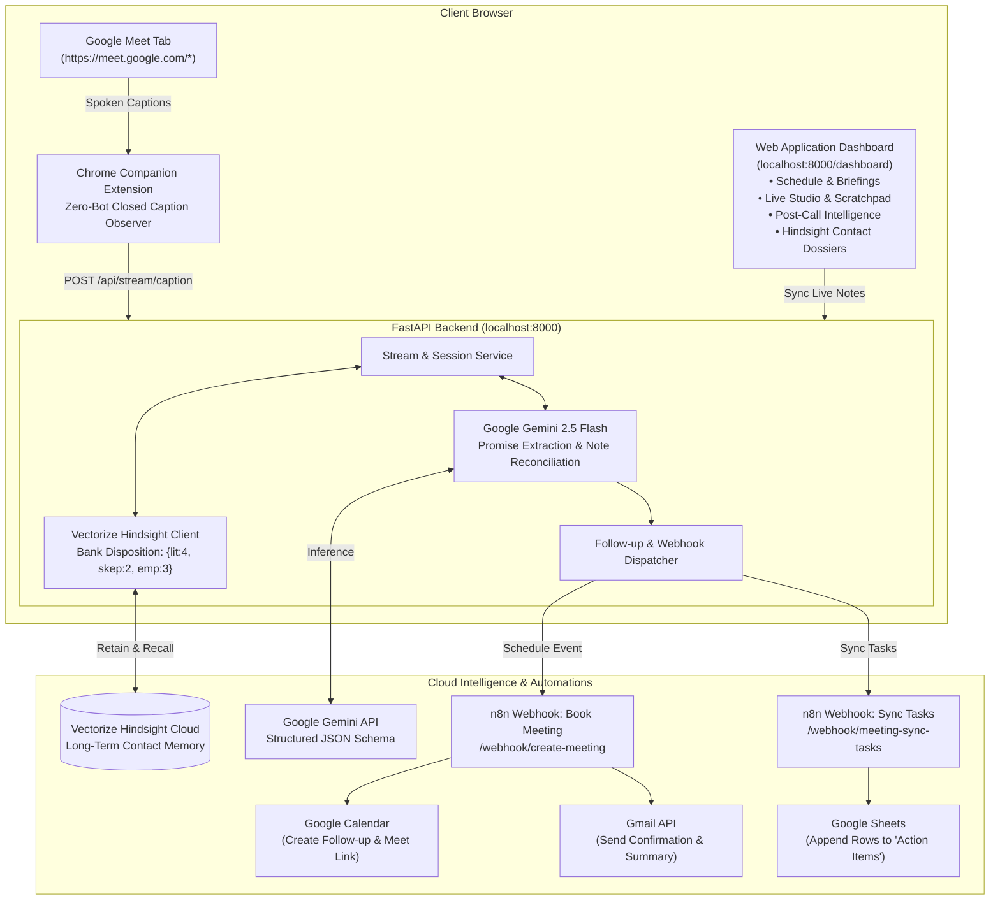

# ⚡ Meeting Intelligence Agent
### Autonomous Meeting Assistant & Follow-Up Automation
**Powered by Vectorize Hindsight, Google Gemini & n8n Workflow Automation**

---

## 💡 What is Meeting Intelligence Agent?

The **Meeting Intelligence Agent** is an autonomous, full-stack assistant that eliminates lost meeting context, manual note-taking hassles, and post-call CRM chores:

1. **Zero-Bot Live Ingestion:** A lightweight Chrome Companion Extension captures closed captions directly in Google Meet (`MutationObserver`). **No awkward third-party bots joining or recording your calls.**
2. **Dual Note System (Live + Post-Meeting):**
   - **During the call:** An interactive **Live Scratchpad** allows you to take private notes with quick tags (`+ Promise`, `+ Decision`, `+ Follow-up`), continuously auto-synced.
   - **After the call:** **Google Gemini** cross-reconciles what was actually spoken against what you typed in your scratchpad, highlighting discrepancies and structuring concrete deliverables.
3. **Long-Term Memory (Vectorize Hindsight):** Retains commitments, relationship dynamics, and contact dossiers across time, automatically preparing proactive pre-meeting briefs before your next call.
4. **Automated Follow-Up via n8n (Google Calendar + Gmail + Google Sheets):** With 1 click, the agent triggers **n8n automation webhooks** that automatically schedule the follow-up on Google Calendar, email meeting minutes directly to attendees via Gmail, and append action items to Google Sheets!

---

## 🏗️ System Architecture



---

## 🎯 How to Test & Use the System (Step-by-Step)

You can test this application in **two ways**: an **Instant 60-Second In-Dashboard Test** (no Google Meet call required), or a **Full Live Call with the Chrome Extension**.

### Option 1: Instant In-Dashboard Test (60 Seconds)
*Recommended for quick verification and hackathon judge demonstrations without needing a live partner.*

1. **Open the Web Dashboard:**
   Navigate to [http://localhost:8000/dashboard](http://localhost:8000/dashboard) in your browser.
2. **Review Pre-Meeting Briefings (View 1):**
   - Click on the first meeting card (*"Enterprise Pricing & Architecture Sync"*).
   - Watch the agent fetch historical context, past promises, and attendee dossiers directly from **Vectorize Hindsight**.
3. **Switch to Live Meeting Studio (View 2):**
   - Click the **"Live Studio & Notes"** tab in the sidebar.
   - Click the **"+ Simulate Line"** button 2 or 3 times to simulate incoming dialogue from a Google Meet call.
   - Click **"Reload Demo Notes"** (or type your own notes in the Scratchpad on the right).
   - Notice the green indicator showing `● Synced with backend`.
4. **Wrap & Analyze the Meeting (View 3):**
   - Click the purple **"🚀 Wrap & Analyze Meeting"** button.
   - **Google Gemini** will immediately synthesize the spoken dialogue against your notes:
     - 📌 **Executive Summary** is generated.
     - 🤝 **Promises by Us** (User Deliverables) are extracted.
     - 🎯 **Promises by Attendees** are identified.
     - 🔍 **Scratchpad vs. Spoken Discrepancies** are flagged.
   - Notice the green confirmation banner: memory is retained into **Vectorize Hindsight Cloud**.
   - Your action items are automatically dispatched to your **n8n Google Sheets webhook** (`/webhook/meeting-sync-tasks`)!
5. **1-Click Follow-Up Scheduling (Live n8n Automation):**
   - At the bottom of the page, review the pre-filled follow-up date and agenda.
   - Click the green **"📅 Confirm & Schedule Next Meeting"** button.
   - The backend calls your live **n8n webhook** (`/webhook/create-meeting`).
   - A success banner will appear displaying:
     - ✅ **Google Calendar Event Link**
     - 🎥 **Real Google Meet Video Link**
     - ✉️ **Confirmation that an email was sent to the attendee via Gmail!**
6. **Inspect Hindsight Contact Dossiers (View 4):**
   - Click **"Hindsight Dossiers"** in the sidebar.
   - View the cumulative relationship history and chronological commitment timeline.

---

### Option 2: Live Google Meet Call (With Companion Extension)

1. **Load the Chrome Extension:**
   - In Google Chrome, go to `chrome://extensions/`.
   - Enable **Developer mode** (toggle in the top-right corner).
   - Click **Load unpacked** (top-left) and select:
     `C:\Users\tanis\OneDrive\Desktop\Meating AI\meeting-intelligence-agent\extension`
2. **Start a Google Meet Call:**
   - Go to [https://meet.google.com/new](https://meet.google.com/new) and join the call.
   - **Turn on Closed Captions:** Click the **CC** button on the bottom bar or press `c` on your keyboard.
   - Look for the floating badge in the bottom-left of Google Meet: `🟢 Captions Streaming to Agent`.
3. **Open the Web Dashboard:**
   - Click the extension icon in your toolbar and click **"Open Web Dashboard ↗"** (or visit [http://localhost:8000/dashboard](http://localhost:8000/dashboard)).
   - Go to **Live Meeting Studio**: Your spoken words will stream into the left pane in real time!
   - Type your notes in the right pane using quick-tag buttons (`+ Promise`, `+ Decision`, `+ Follow-up`).
4. **End & Reconcile:**
   - When the call concludes, click **"Wrap & Analyze Meeting"** in the dashboard to trigger Gemini analysis, Hindsight memory retention, and follow-up scheduling.

---

### Option 3: Automated Pytest Suite

Run the complete 11-test automated suite covering all routes, services, memory operations, and reconciliation logic:
```powershell
cd "meeting-intelligence-agent\backend"
venv\Scripts\pytest -v
```
All 11 tests pass:
- `test_calendar_routes.py`: Calendar upcoming events & follow-up scheduling schema.
- `test_hindsight.py`: Memory bank creation, disposition parameters, retain & recall cycles.
- `test_llm_pipeline.py`: Gemini commitment extraction, discrepancy detection, and JSON parsing resilience.
- `test_stream_and_dashboard.py`: Caption ingestion, scratchpad sync, dashboard serving, and contact dossiers.

---

## ⚙️ Environment Configuration (`.env`)

In `meeting-intelligence-agent/backend/.env`:

```env
# 1. Vectorize Hindsight Memory Bank (https://vectorize.io)
HINDSIGHT_API_URL=https://api.hindsight.vectorize.io
HINDSIGHT_API_KEY=your_hindsight_api_key

# 2. Google Gemini LLM Configuration (https://aistudio.google.com)
GEMINI_API_KEY=your_gemini_api_key
GEMINI_MODEL=gemini-2.5-flash

# 3. n8n Automation Webhooks (Google Calendar, Gmail & Google Sheets)
N8N_CREATE_MEETING_WEBHOOK_URL=https://vijaysiddhath.app.n8n.cloud/webhook/create-meeting
N8N_SYNC_TASKS_WEBHOOK_URL=https://vijaysiddhath.app.n8n.cloud/webhook/meeting-sync-tasks

# 4. Server Configuration
HOST=0.0.0.0
PORT=8000
```

---

## 🌟 Key Features Breakdown

### 1. 🤖 Zero-Bot Client-Side Capture (Chrome Extension)
- Works completely client-side by observing the official Google Meet Closed Captions DOM elements.
- No intrusive external meeting bots joining your video conference.
- Displays an in-call floating status badge: `🟢 Captions Streaming to Agent`.
- Includes a 1-click **"Open Web Dashboard ↗"** popup.

### 2. ✍️ Live Scratchpad & Real-Time Sync (During the Call)
- Located in **View 2: Live Meeting Studio** side-by-side with incoming live transcript.
- Fast-tag buttons: `+ Promise`, `+ Decision`, `+ Follow-up`.
- Live auto-sync indicator (`● Synced with backend`) ensuring you never lose a note.

### 3. 🔍 Post-Meeting Intelligence & Discrepancy Reconciliation
- Powered by **Google Gemini (`gemini-2.5-flash`)**.
- **Cross-Reconciliation:** Compares your scratchpad notes with spoken dialogue and flags contradictions in real time.
- **Structured Deliverables:**
  - 🤝 **Promises Made by Us:** Deliverables the host committed to.
  - 🎯 **Promises Made by Them:** Commitments given by partners/clients.
  - ❓ **Unresolved Questions:** Pending questions needing follow-up.
  - 📌 **Executive Summary:** High-level meeting takeaways.

### 4. 🧠 Vectorize Hindsight Long-Term Memory
- Integrates the official `hindsight-client` Python SDK.
- Configured with Bank Mission and calibrated disposition:
  ```python
  disposition_literalism = 4  # High factual accuracy
  disposition_skepticism = 2  # Balanced critical analysis
  disposition_empathy = 3     # Context-aware understanding
  ```
- **Pre-Meeting Briefings:** Automatically recalls prior commitments before scheduled calls.
- **Contact Dossiers:** Searchable relationship history and chronological commitment log for every client.

### 5. ⚡ Automated Action via n8n (Calendar + Gmail + Google Sheets)
- **Book a Meeting (`/webhook/create-meeting`):** Creates the Google Calendar event, generates a real Google Meet link, and sends an invite confirmation to attendees via Gmail.
- **Sync Tasks (`/webhook/meeting-sync-tasks`):** Appends each extracted action item as a row in the "Action Items" tab of your Google Sheet with task title, owner, and due date.

---

## 🏆 Hackathon Alignment Checklist

- [x] **Hindsight Memory Engine (25% Criteria):** Uses `hindsight-client` with bank disposition `{literalism: 4, skepticism: 2, empathy: 3}`, `budget="mid"`, stringified metadata, and contact dossier tracking.
- [x] **Zero Third-Party Meeting Bots:** Uses DOM closed caption streaming from Chrome Extension.
- [x] **Google Gemini Inference:** High-speed, structured extraction and discrepancy reconciliation.
- [x] **Dual Note-Taking & Reconciliation:** Real-time scratchpad auto-sync + post-call synthesis.
- [x] **Automated Calendar, Gmail & Sheets Action:** n8n webhook integration for zero-friction follow-ups.
- [x] **Repository Security:** `.gitignore` configured to keep API keys and virtual environments safe.
