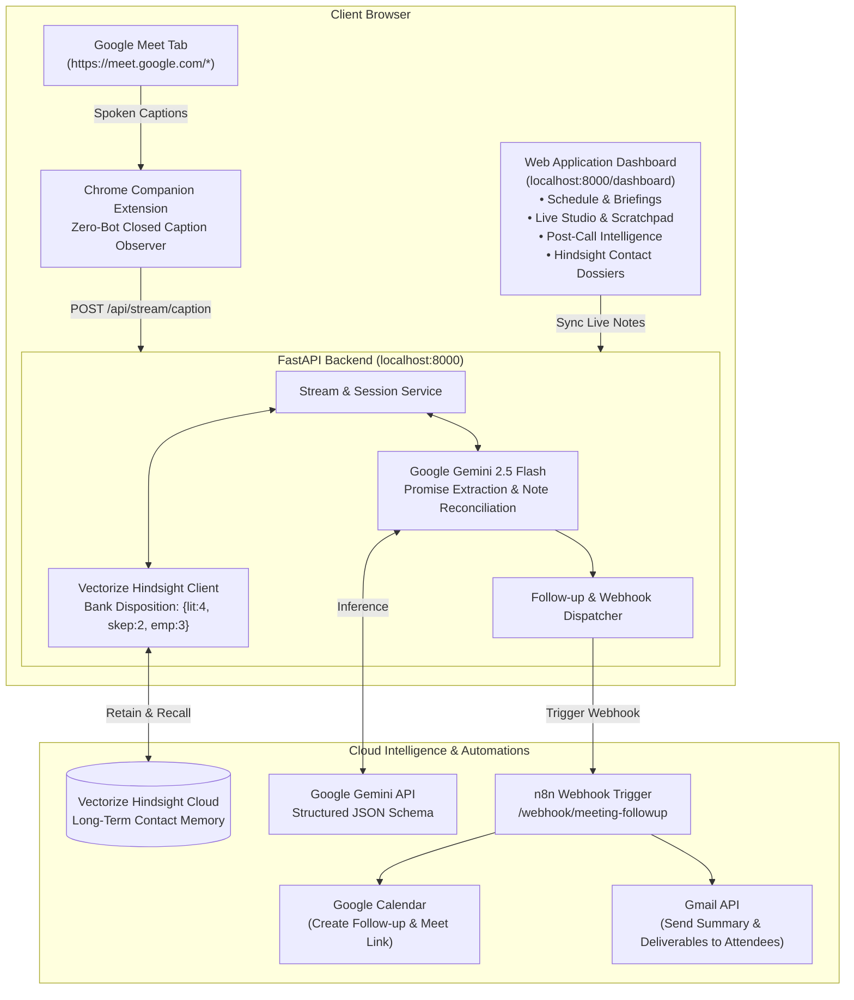

# ⚡ Meeting Intelligence Agent
### Autonomous Meeting Assistant & Follow-Up Automation
**Powered by Vectorize Hindsight, Google Gemini & n8n Workflow Automation**

---

## 💡 What is Meeting Intelligence Agent?

The **Meeting Intelligence Agent** is an autonomous, full-stack assistant that eliminates lost meeting context, manual note-taking hassles, and post-call CRM chores:

1. **Zero-Bot Live Ingestion:** A lightweight Chrome Companion Extension captures closed captions directly in Google Meet (`MutationObserver`). **No awkward third-party bots joining or recording your calls.**
2. **Dual Note System (Live + Post-Meeting):**
   - **During the call:** An interactive **Live Scratchpad** allows you to take private notes with quick tags (`+ Promise`, `+ Decision`, `+ Follow-up`), continuously auto-synced.
   - **After the call:** **Google Gemini** cross-reconciles what was actually spoken against what you typed in your scratchpad, highlighting discrepancies and structuring concrete deliverables.
3. **Long-Term Memory (Vectorize Hindsight):** Retains commitments, relationship dynamics, and contact dossiers across time, automatically preparing proactive pre-meeting briefs before your next call.
4. **Automated Follow-Up via n8n (Google Calendar + Gmail):** With 1 click, the agent triggers an **n8n automation webhook** that automatically schedules the follow-up on Google Calendar and sends meeting minutes directly to all attendees via Gmail.

---

## 🏗️ System Architecture



---

## 🌟 Key Features

### 1. 🤖 Zero-Bot Client-Side Capture (Chrome Extension)
- Works completely client-side by observing the official Google Meet Closed Captions DOM elements.
- No intrusive external meeting bots joining your video conference.
- Displays an in-call floating status badge: `🟢 Captions Streaming to Agent`.
- Includes a 1-click **"Open Web Dashboard ↗"** popup.

### 2. ✍️ Live Scratchpad & Real-Time Sync (During the Call)
- Located in **View 2: Live Meeting Studio** side-by-side with incoming live transcript.
- Fast-tag buttons: `+ Promise`, `+ Decision`, `+ Follow-up`.
- Live auto-sync indicator (`● Synced with backend`) ensuring you never lose a note.

### 3. 🔍 Post-Meeting Intelligence & Discrepancy Reconciliation
- Powered by **Google Gemini (`gemini-2.5-flash`)**.
- **Cross-Reconciliation:** Compares your scratchpad notes with spoken dialogue and flags contradictions in real time (e.g., *“Scratchpad noted Friday delivery, but spoken words agreed to Thursday 5 PM”*).
- **Structured Deliverables:**
  - 🤝 **Promises Made by Us:** Deliverables the host committed to.
  - 🎯 **Promises Made by Them:** Commitments given by partners/clients.
  - ❓ **Unresolved Questions:** Pending questions needing follow-up.
  - 📌 **Executive Summary:** High-level meeting takeaways.
- **Editable Follow-Up Agenda:** Edit or add extra notes before finalizing.

### 4. 🧠 Vectorize Hindsight Long-Term Memory
- Integrates the official `hindsight-client` Python SDK.
- Configured with Bank Mission and calibrated disposition:
  ```python
  disposition_literalism = 4  # High factual accuracy
  disposition_skepticism = 2  # Balanced critical analysis
  disposition_empathy = 3     # Context-aware understanding
  ```
- **Pre-Meeting Briefings:** Automatically recalls prior commitments before scheduled calls.
- **Contact Dossiers:** Searchable relationship history and chronological commitment log for every client.

### 5. ⚡ Automated Action via n8n (Calendar + Gmail)
- Eliminates OAuth headaches by connecting directly to an **n8n automation workflow**.
- Clicking **"Confirm & Schedule Next Meeting"** dispatches a structured payload to your n8n webhook.
- n8n instantly:
  1. Creates the follow-up meeting in **Google Calendar** with an auto-generated Google Meet link.
  2. Sends an email via **Gmail** to all attendees containing the executive summary, user promises, and attendee deliverables.

---

## 🚀 Quick Start Guide

### Step 1: Clone & Configure Environment
In `meeting-intelligence-agent/backend/.env`:
```env
# Google Gemini API Key (Get free from https://aistudio.google.com/app/apikey)
GEMINI_API_KEY="your-gemini-api-key"
GEMINI_MODEL="gemini-2.5-flash"

# Vectorize Hindsight Configuration
HINDSIGHT_API_KEY="your-hindsight-key"
HINDSIGHT_API_URL="https://api.hindsight.vectorize.io"
HINDSIGHT_BANK_ID="meeting_intelligence_bank"

# Optional: n8n Webhook for Google Calendar & Gmail automation
N8N_WEBHOOK_URL="https://your-n8n-instance.com/webhook/meeting-followup"

# Server Settings
HOST="0.0.0.0"
PORT=8000
```

### Step 2: Start the Backend & Web Dashboard
```powershell
cd "meeting-intelligence-agent\backend"
venv\Scripts\python.exe -m uvicorn app.main:app --host 0.0.0.0 --port 8000 --reload
```
Open your browser at: **[http://localhost:8000/dashboard](http://localhost:8000/dashboard)**

### Step 3: Load the Companion Chrome Extension
1. Open Google Chrome and navigate to `chrome://extensions/`.
2. Toggle on **Developer mode** (top-right switch).
3. Click **Load unpacked** (top-left button).
4. Select the directory:
   `c:\Users\tanis\OneDrive\Desktop\Meating AI\meeting-intelligence-agent\extension`
5. The extension icon will now appear in your toolbar!

---

## 🔄 The 4-Step Meeting Cycle

| Step | Interface | What Happens |
| :--- | :--- | :--- |
| **1. Pre-Meeting Briefing** | **Web Dashboard (View 1)** | View upcoming meetings. Click any call to fetch instant context and prior commitments from Hindsight. |
| **2. Live Call & Notes** | **Google Meet + Dashboard (View 2)** | Turn on CC in Google Meet. Speech streams live to the dashboard while you take private notes in the scratchpad. |
| **3. Wrap & Reconcile** | **Web Dashboard (View 3)** | Click *"Wrap & Analyze"*. Gemini identifies commitments and reconciles note discrepancies. Facts are saved to Hindsight. |
| **4. 1-Click Follow-Up** | **n8n Automation** | Click *"Confirm & Schedule"*. n8n creates the Google Calendar event and emails meeting notes to all attendees via Gmail. |

---

## ⚙️ n8n Workflow Configuration (Calendar + Gmail)

Your n8n workflow only requires **3 simple nodes**:

```
[ Webhook Node (POST) ]
         │
         ├──► [ Google Calendar Node: "Create Event" ]
         │
         └──► [ Gmail Node: "Send Email" ]
```

### Webhook Payload Example:
```json
{
  "event_id": "evt-12345",
  "summary": "Follow-up: Enterprise Architecture & Pricing",
  "start_time": "2026-10-02T15:00:00Z",
  "end_time": "2026-10-02T15:30:00Z",
  "attendee_emails": ["sarah.connor@acme.org"],
  "agenda": "Review questionnaire results and finalize pricing.",
  "meet_link": "https://meet.google.com/abc-defg-hij"
}
```

---

## 🧪 Automated Tests (11/11 Passing)

Run the test suite to verify full integration:
```powershell
cd "meeting-intelligence-agent\backend"
venv\Scripts\pytest -v
```

```
tests/test_calendar_routes.py::test_calendar_upcoming_events PASSED       [  9%]
tests/test_calendar_routes.py::test_calendar_schedule_followup_schema PASSED [ 18%]
tests/test_calendar_routes.py::test_end_to_end_meeting_flow PASSED        [ 27%]
tests/test_hindsight.py::test_bank_creation_and_disposition PASSED        [ 36%]
tests/test_hindsight.py::test_hindsight_retention_and_recall_cycle PASSED  [ 45%]
tests/test_hindsight.py::test_recall_for_unknown_attendee PASSED          [ 54%]
tests/test_llm_pipeline.py::test_llm_pipeline_extraction_and_reconciliation PASSED [ 63%]
tests/test_llm_pipeline.py::test_json_parsing_resilience PASSED           [ 72%]
tests/test_stream_and_dashboard.py::test_serve_dashboard_page PASSED      [ 81%]
tests/test_stream_and_dashboard.py::test_stream_caption_and_notes_ingestion PASSED [ 90%]
tests/test_stream_and_dashboard.py::test_todays_calendar_and_contact_dossier PASSED [100%]
======================= 11 passed in 27.97s =======================
```

---

## 🏆 Hackathon Alignment Checklist

- [x] **Hindsight Memory Engine (25% Criteria):** Uses `hindsight-client` with bank disposition `{literalism: 4, skepticism: 2, empathy: 3}`, `budget="mid"`, stringified metadata, and contact dossier tracking.
- [x] **Zero Third-Party Meeting Bots:** Uses DOM closed caption streaming from Chrome Extension.
- [x] **Google Gemini Inference:** High-speed, structured extraction and discrepancy reconciliation.
- [x] **Dual Note-Taking & Reconciliation:** Real-time scratchpad auto-sync + post-call synthesis.
- [x] **Automated Calendar & Gmail Action:** n8n webhook integration for zero-friction follow-ups.
- [x] **Repository Security:** `.gitignore` configured to keep API keys and virtual environments safe.
