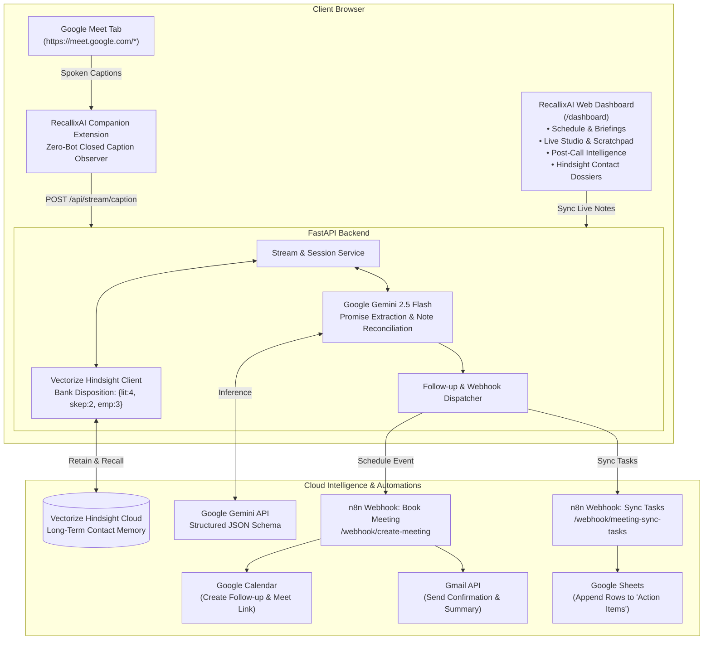

# ⚡ RecallixAI
### AI-Powered Meeting Intelligence & Automated Follow-Up Platform
**Powered by Vectorize Hindsight Cloud, Google Gemini 2.5 & n8n Workflow Automation**

---

> 🛠️ **Maintenance Notice:** The live audio recording and real-time caption ingestion pipeline is currently undergoing scheduled maintenance. All pre-meeting briefs, past meeting transcripts, client management, and 1-click Google Calendar scheduling remain 100% active and functional.

---

## 💡 About RecallixAI

**RecallixAI** is an autonomous, full-stack meeting intelligence platform designed to eliminate lost meeting context, manual note-taking friction, and post-call CRM overhead.

Key capabilities include:

1. **Zero-Bot Live Speech Ingestion:** A lightweight Chrome Companion Extension captures closed captions directly in Google Meet (`MutationObserver`). **No third-party bots joining or recording your video calls.**
2. **Dual Note System (Live Scratchpad + Post-Meeting AI Synthesis):**
   - **During the Call:** Private scratchpad notes with quick action tags (`[Promise: ]`, `[Decision: ]`, `[Action: ]`), continuously auto-synced.
   - **After the Call:** **Google Gemini 2.5** cross-reconciles spoken dialogue against scratchpad notes, extracting deliverables and highlighting discrepancies.
3. **Long-Term Memory (Vectorize Hindsight Cloud):** Stores commitments, client relationships, and meeting dossiers across time, automatically assembling pre-meeting briefs before your next scheduled call.
4. **Automated Follow-Up via n8n (Google Calendar + Gmail + Google Sheets):** Dispatches 1-click webhooks to automatically schedule follow-up meetings on Google Calendar, email meeting minutes via Gmail, and append action items to Google Sheets.

---

## 🏗️ System Architecture



---

## 🌟 Core Features Breakdown

### 1. 🤖 Zero-Bot Client-Side Capture (Chrome Extension)
- Operates client-side by observing Google Meet Closed Captions (`[CC]`).
- No intrusive external meeting bots joining video conferences.
- Displays an in-call floating status badge (`⚡ RecallixAI: Listening`).

### 2. ✍️ Live Scratchpad & Real-Time Sync
- Located in **RecallixAI Studio** side-by-side with incoming live transcripts.
- Quick-tag buttons: `⭐ Promise`, `✅ Decision`, `💡 Follow-up`.
- Real-time auto-sync (`● Synced with backend`) ensuring no notes are lost.

### 3. 🔍 Post-Meeting Intelligence & Discrepancy Reconciliation
- Powered by **Google Gemini (`gemini-2.5-flash`)**.
- **Cross-Reconciliation:** Compares scratchpad notes against spoken dialogue and flags discrepancies in real time.
- **Structured Deliverables:**
  - 🙋 **Promises Made by You:** Deliverables committed by the host.
  - 👥 **Promises Made by Client:** Commitments given by partners/clients.
  - ❓ **Unresolved Questions:** Pending items requiring follow-up.
  - 📌 **Executive Summary:** High-level meeting takeaways.

### 4. 🧠 Vectorize Hindsight Long-Term Memory
- Integrates the `hindsight-client` Python SDK with calibrated disposition parameters (`literalism: 4`, `skepticism: 2`, `empathy: 3`).
- **Pre-Meeting Briefings:** Automatically recalls past commitments before scheduled calls.
- **Client Dossiers:** Searchable relationship history and commitment timelines for every client.

### 5. ⚡ Automated Action via n8n (Calendar + Gmail + Google Sheets)
- **Book a Meeting (`/webhook/create-meeting`):** Creates the Google Calendar event, generates a real Google Meet link, and sends an invite confirmation via Gmail.
- **Sync Tasks (`/webhook/meeting-sync-tasks`):** Appends each extracted action item as a row in Google Sheets.

---

## 🚀 Getting Started & Setup Guide

### 1. Prerequisites
- **Python 3.10+**
- **Google Chrome** (for RecallixAI Companion Extension)
- **API Keys**: Google Gemini API Key & Vectorize Hindsight API Key

### 2. Installation & Running Backend
```bash
# Navigate to backend directory
cd meeting-intelligence-agent/backend

# Create virtual environment and activate
python -m venv venv
# On Windows PowerShell:
.\venv\Scripts\Activate.ps1

# Install dependencies
pip install -r requirements.txt

# Start Uvicorn server
python -m uvicorn app.main:app --host 0.0.0.0 --port 8000 --reload
```

### 3. Environment Configuration (`.env`)
Create `.env` inside `meeting-intelligence-agent/backend/`:
```env
# Vectorize Hindsight Memory Bank
HINDSIGHT_API_URL=https://api.hindsight.vectorize.io
HINDSIGHT_API_KEY=your_hindsight_api_key

# Google Gemini LLM Configuration
GEMINI_API_KEY=your_gemini_api_key
GEMINI_MODEL=gemini-2.5-flash

# n8n Automation Webhooks
N8N_CREATE_MEETING_WEBHOOK_URL=https://vijaysiddhath.app.n8n.cloud/webhook/create-meeting
N8N_SYNC_TASKS_WEBHOOK_URL=https://vijaysiddhath.app.n8n.cloud/webhook/meeting-sync-tasks

# Server Config
HOST=0.0.0.0
PORT=8000
```

### 4. Loading the Chrome Extension
1. Open Chrome and navigate to `chrome://extensions/`.
2. Toggle **Developer mode** ON (top-right).
3. Click **Load unpacked** (top-left) and select the `meeting-intelligence-agent/extension` folder.

---

## 🎯 How to Use RecallixAI

1. **Dashboard Navigation (`/dashboard`):**
   - **1. Today Meeting & Follow Up:** View upcoming calls, recall pre-meeting briefs from Hindsight, and schedule 1-click follow-ups.
   - **2. Live Speech & AI Summary (RecallixAI Studio):** Ingest dialogue, take scratchpad notes, and click **"Wrap & Generate AI Summary"**.
   - **3. Clients & Memories:** Manage client profiles, view past meeting history, and inspect full raw transcripts.
2. **Automated Testing Suite:**
   ```powershell
   cd meeting-intelligence-agent/backend
   venv\Scripts\pytest -v
   ```
